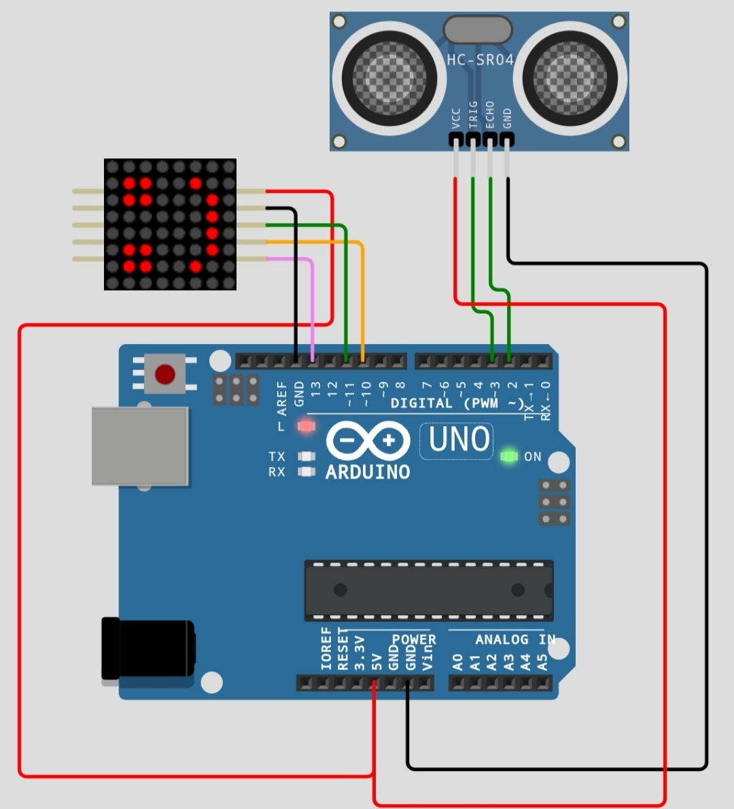

# distance-indicator-with-emoticon_arduino-uno-r3
distance-indicator-with-emoticon_arduino-uno-r3
## Necessary materials
1. Arduino Uno
2. MAX7219 8x8 LED DOT MATRIX DISPLAY MODULE
3. HC-SR04 Ultrasonic Sensor 
4. Jumper Wire
# Wiring
 
## Code
add library ledcontrol https://downloads.arduino.cc/libraries/github.com/wayoda/LedControl-1.0.6.zip  
and load compile upload this code to your projects
https://github.com/fajarjulyana/distance-indicator-with-emoticon_arduino-uno-r3/blob/9f41aec18fef7304146de95dcb64eea990069e10/src/code.cpp#L1-L160
# Capture
## Smile
 
## flat
 
## bored
 
